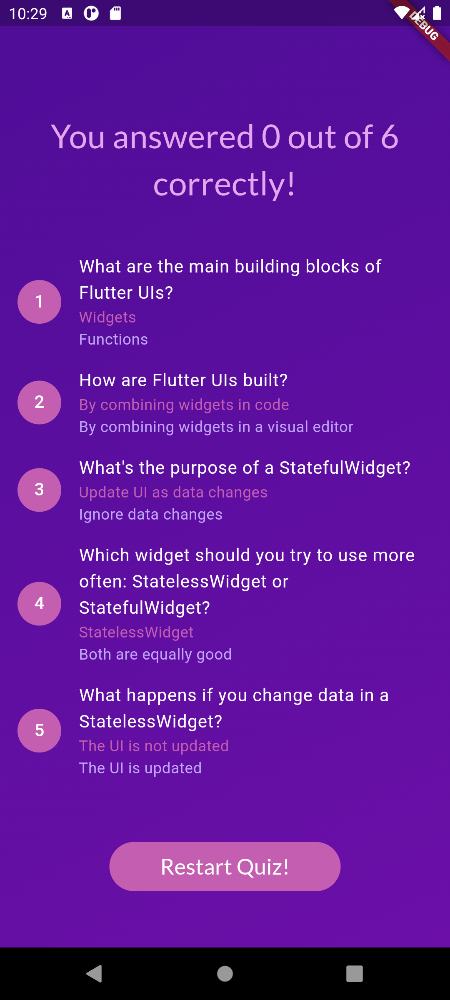

# My First Flutter App {Quiz App}

Welcome to my first app using Flutter! It's been a great experience for me to discover a new field that I'm passionate about. This app is designed to provide a simple yet engaging way to learn some basics about Flutter through a quiz format.

## Features

- **Splash Screen**: The app starts with a splash screen that contains some useful information about the app.
  


- **Quiz**: After the splash screen, the app presents a quiz with basic questions about Flutter to help you get started.

<div style="display: flex; justify-content: space-around; gap: 5px;">
  
  
  
  
  
  
</div>

## Getting Started

### Prerequisites

Make sure you have Flutter installed on your machine. You can follow the official [Flutter installation guide](https://flutter.dev/docs/get-started/install) for your operating system.

### Installation

1. Clone the repository:
    ```sh
    git clone https://github.com/RAFYA-Hamza/quiz-app-flutter.git
    ```
2. Navigate to the project directory:
    ```sh
    cd quiz-app-flutter
    ```
3. Get the required dependencies:
    ```sh
    flutter pub get
    ```

### Running the App

To run the app on an emulator or a physical device, use the following command:
```sh
flutter run
